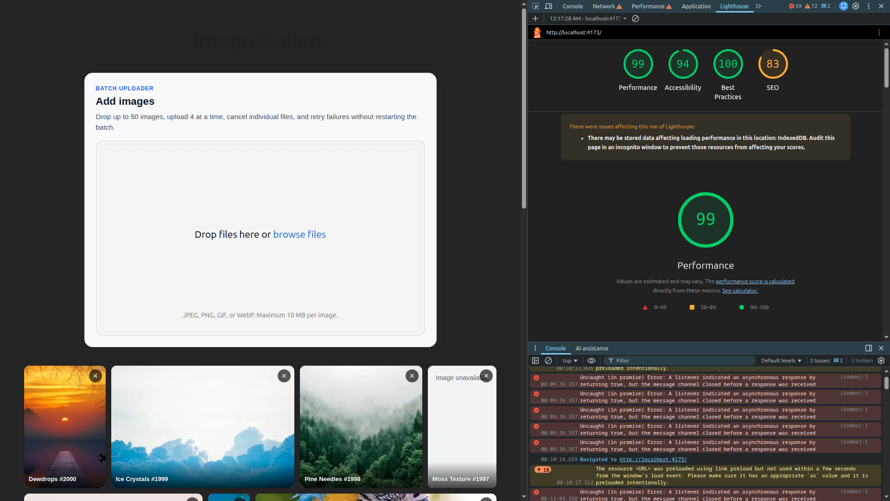
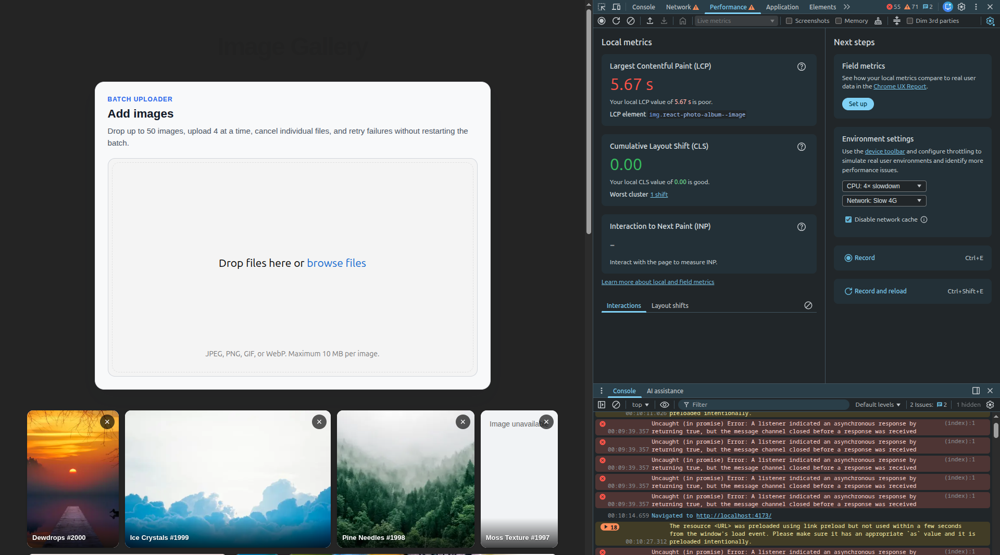

# Notes

## What I Measured

Chrome Lighthouse snapshot after the gallery and upload changes:

[Open the Lighthouse screenshot directly](lighthouse.png)

Chrome DevTools local metrics snapshot:

[Open the DevTools performance screenshot directly](perf.png)

- Lighthouse: Performance 99, Accessibility 94, Best Practices 100, SEO 83.
- DevTools local metrics: LCP 5.67s, CLS 0.00, INP not captured.
- Test conditions shown in the screenshot: Slow 4G network, CPU 4x slowdown,
  and disabled cache.

## Key Tradeoffs

- Used `react-photo-album` rows layout to handle mixed aspect ratios without
  layout shift while keeping the implementation small and readable.
- Loaded the gallery incrementally with cursor pagination instead of rendering
  all seeded images on first mount.
- Served thumbnail URLs with `srcset`, lazy loaded non-priority images, and
  preloaded only the first few likely LCP candidates.
- Used Uppy for batch uploads because it gives drag-and-drop, concurrent
  uploads, per-file cancel/retry, and refresh recovery without building a large
  custom queue.
- Did not add a full virtualization layer yet; with row-based responsive layout,
  pagination was the lower-risk first step for this exercise.

## What I Would Do Next

- Since a lot of this was build under time pressure & using llms, i would most likely want to spend the next half day reading & understanding the code completely. This is not the case atm.

Then it really depends on the business requirements.

- We can further improve the technical side: we didn't quite hit the required metric of 2.5s LCP. (for these kind of performances I believe the SSR path will be the best, especially once we start adding per user images). There is no test at the moment.

- Or we can greatly improve the UX, it let a lot to be desired atm (we can display the uploader as a modal or side pannel only when needed, we can improve the branding of the page, enable users to select multiple image for quick actions like delete or move, or add a local svg for unavailable images)
